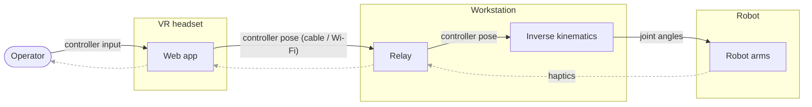

# vr-teleop-kit

A kit for teleoperating robot manipulators with a WebXR headset
(Meta Quest). A web page served from your workstation runs in the Quest
browser, streams 6-DoF controller poses over a WebSocket, and a Python
teleoperator turns them into joint commands via differential inverse
kinematics (forward kinematics and Jacobians read from a MuJoCo model
of the arm, built from its URDF). Plugs into [LeRobot](https://github.com/huggingface/lerobot)
as a drop-in `Teleoperator`.

> **Full write-up:** [**VR Teleoperation Stack for Robot Manipulation**](https://aurelarnold.xyz/blog/vr-teleoperation-stack/) walks through the whole stack: the inverse kinematics, the safety features, and the camera and haptic feedback that close the loop.

The robot currently supported end-to-end is the
[TRLC-DK1](https://www.robot-learning.co) bimanual arm. The pose mapping
and the relay are robot-agnostic; supporting another arm means porting
the IK layer (see "Adapting to a different arm" below).

Highlights:

- **Clutch-relative mapping**: hold the grip button and the robot follows
  your hand's relative motion; release, reposition, grab again.
- **Controller buttons**: grip = clutch; a precision modifier (hold to
  lower the gains for fine work); and a button that sends the arm back to
  its home pose.
- **Reach limit**: the target pose can never run more than a fixed
  distance or angle ahead of the robot. Pressing past a joint limit or the
  workspace boundary feels like a wall (with haptic feedback), and
  reversing bites immediately, like a mouse cursor at the edge of the
  screen.
- **Decoupled IK**: joints 1-3 track position, the
  wrist tracks orientation, both as damped-least-squares steps with
  manipulability-adaptive damping (graceful near singularities and
  gimbal lock).
- **Wrist-pivot calibration**: a 5-second in-VR ritual aligns the
  controller read-out point with your anatomical wrist pivot, so pure
  wrist twists don't drag the arm around.
- **Haptics**: gripper grasp force and IK trouble (joint limits, reach,
  gimbal proximity) are mapped to controller vibration.
- **Camera streaming**: optional WebRTC streams of robot cameras,
  rendered as world-locked panels inside VR.
- **Two ways to connect**: USB cable (`adb reverse`, ~1 ms latency,
  recommended) or Wi-Fi (LAN HTTPS with a self-signed certificate). A
  public tunnel works for pose streaming too, but the WebRTC camera media
  is not configured off-LAN (it needs a TURN server), so full remote
  operation isn't set up.
- Live-tunable settings (gains, smoothing, velocity caps, haptic
  thresholds) from the web page, applied on the next solver tick.

## Architecture

Three layers, separated by how robot-specific they are:

```
src/vr_teleop_kit/
├── core/      robot-agnostic: clutch-relative pose mapping + reach limit
├── relay/     robot-agnostic: FastAPI WebSocket relay, WebRTC cameras,
│              and the WebXR page served to the Quest
├── ik/        DK1-tuned: decoupled IK (MuJoCo model
│              built from the DK1 URDF, wrist-anchor geometry, mount frames)
└── lerobot/   thin adapter: LeRobot Teleoperator classes wiring core+ik
               into the LeRobot action interface
```



For pose and state messages the relay is a pure broadcast hub: any number
of clients (teleop processes, MuJoCo viewers) can subscribe to the same
stream. (It also publishes the optional WebRTC camera tracks.)

## Install

```bash
git clone https://github.com/Dream-Machines-Robotics/vr-teleop-kit
cd vr-teleop-kit
pip install -e ".[relay,lerobot]"           # or: uv pip install -e ".[relay,lerobot]"

# DK1 driver (also provides the URDF):
git clone https://github.com/robot-learning-co/trlc-dk1
pip install -e ./trlc-dk1

# Point the IK at the URDF (or pass urdf_path in the teleop config):
export DK1_URDF=$PWD/trlc-dk1/urdf/follower/TRLC-DK1-Follower.urdf
```

The `relay` extra covers the server (FastAPI, aiortc, OpenCV); the
`lerobot` extra covers the Teleoperator adapter. The bare package (pose
mapping + IK) only needs numpy, mujoco and websockets.

## Run the relay and connect the headset

Both transports serve the same page on port 8443; they differ only in
how the Quest reaches it. WebXR requires a secure context, which is why
the two paths exist.

**USB (recommended)**: plain HTTP on localhost (a secure context per the
WebXR spec), forwarded over the cable:

```bash
vr-teleop-relay                               # binds 127.0.0.1:8443
adb reverse tcp:8443 tcp:8443                 # forward Quest's localhost over USB
# Quest browser → http://localhost:8443/
```

One-time Quest setup: enable Developer Mode (Meta Quest mobile app →
Devices → your headset → Developer Mode), plug in the cable, accept the
"Allow USB debugging" prompt in the headset. `adb reverse` must be re-run
after re-plugging the cable.

**LAN**: HTTPS with a self-signed certificate; the Quest shows a
"not secure" warning the first time, which you accept:

```bash
mkdir -p certs
openssl req -x509 -newkey rsa:4096 -nodes -days 825 \
    -keyout certs/key.pem -out certs/cert.pem \
    -subj "/CN=$(hostname)" \
    -addext "subjectAltName=DNS:$(hostname),DNS:localhost,IP:127.0.0.1,IP:<your-lan-ip>"
vr-teleop-relay --host 0.0.0.0 --ssl-keyfile certs/key.pem --ssl-certfile certs/cert.pem
# Quest browser → https://<your-lan-ip>:8443/
```

`certs/` is gitignored; never commit key material. USB has ~1 ms RTT and
no jitter; LAN works but Wi-Fi adds occasional >100 ms spikes. A public
tunnel (e.g. `cloudflared tunnel --url http://localhost:8443`) also works
for pose streaming, but WebRTC camera media is peer-to-peer and needs a
TURN server off-LAN (not configured here).

On the page: **Calibrate wrist** once per operator (squeeze both grips
in VR, then for 5 s twist your hands while keeping each wrist roughly in
place: the hand rotates, the wrist pivot stays still), then
**Start Teleop**. Settings (gains, smoothing, velocity caps, haptics)
are on the same page and apply live.

## Try it without a robot

```bash
vr-teleop-relay                       # terminal 1
python tools/viewer_client.py         # terminal 2: MuJoCo viewer (uses DK1_URDF)
python examples/pure_sim.py           # terminal 3: IK loop, no hardware
# Quest browser → Start Teleop → squeeze a grip
```

`tools/smoke_test.py` drives the full pipeline with a fake Quest client
and asserts on the resulting actions (no headset needed).

(`pure_sim.py` and `smoke_test.py` use the LeRobot Teleoperator adapter,
so they need the `[lerobot]` extra — installed by the Install command
above, not just the bare package.)

## Use as a LeRobot Teleoperator

The adapter emits the exact action dict the DK1 followers expect
(`{left,right}_joint_{1..6}.pos`, `{left,right}_gripper.pos`), so it
pairs with an unmodified `BiDK1Follower`. Nothing is copied into
LeRobot's tree; you instantiate and hand it to your loop:

```python
import time

from vr_teleop_kit.lerobot import BiQuestTeleoperator, BiQuestTeleoperatorConfig
from lerobot_robot_trlc_dk1.bi_follower import BiDK1Follower, BiDK1FollowerConfig

teleop = BiQuestTeleoperator(BiQuestTeleoperatorConfig(
    id="vr-teleop",
    ws_url="ws://127.0.0.1:8443/ws",
    urdf_path="/path/to/TRLC-DK1-Follower.urdf",   # or set DK1_URDF
))
follower = BiDK1Follower(BiDK1FollowerConfig(left_arm_port=..., right_arm_port=...))

teleop.connect(); follower.connect()
while True:
    follower.send_action(teleop.get_action())
    time.sleep(1 / 200)
```

`examples/teleop_bi_dk1.py` is the complete version of this loop (rest
ramp, haptic feedback, timing). For LeRobot CLIs, import
`vr_teleop_kit.lerobot` so the `@register_subclass` decorators run, then
use `--teleop.type=bi_quest_teleop` (bimanual) or
`single_arm_quest_teleop` (one arm, unprefixed action keys).

For human-in-the-loop data collection: the teleop exposes intervention
hooks (`is_engaged`, `is_handoff_pressed`, `is_pause_pressed`,
`is_reverse_pressed`, `seed_qpos_from_obs`, `publish_state`) that an
orchestrator can poll to hand control between a policy and the operator.
We use these for an HG-DAgger workflow built on top of this stack in our
LeRobot fork; that workflow is not part of this repository.

## Enabling grasp-force haptics

The grasp-force haptic (the controller buzzing as the gripper closes on an
object) reads the gripper torque through an optional follower method,
`get_joint_torques()`, returning
`{"{left_,right_}gripper.torque": Nm, "{left_,right_}gripper.pos": 0..1}`.
This step is optional: the teleop feature-detects the method via `getattr`
and degrades gracefully without it, disabling only the grasp-force
vibration (the IK-trouble haptics still fire).

The stock [robot-learning-co/trlc-dk1](https://github.com/robot-learning-co/trlc-dk1)
driver does not ship this method, but it is a small addition on top of
plumbing the driver already has (`Motor.getTorque()`, which it calls during
gripper homing). Add to `DK1Follower`:

```python
def get_joint_torques(self) -> dict[str, float]:
    # Side-channel for haptics; keep it OUT of observation_features so it
    # never enters the dataset schema. Return {} if torque is unavailable.
    self.control.refresh_motor_status(self.motors["gripper"])
    return {
        "gripper.torque": float(self.motors["gripper"].getTorque()),
        "gripper.pos":    ...,  # gripper position normalized to 0..1
    }
```

and mirror it on `BiDK1Follower` by calling each arm's `get_joint_torques()`
and prefixing the keys with `left_` / `right_`. Any driver that implements
the method with this contract gets grasp-force haptics with no other
changes.

## Configuration that is DK1-specific

- **URDF path**: `DK1_URDF` env var or `urdf_path` in the config. The
  URDF lives in the [trlc-dk1
  repo](https://github.com/robot-learning-co/trlc-dk1) and is not
  vendored here.
- **`r_calib`** (config): the fixed rotation from the Quest's
  `local-floor` world frame into the arm base frame. The default assumes
  the operator faces the robot's front; if your mounting differs,
  re-derive it by mapping the operator's forward/left/up directions onto
  arm-base axes (the per-engage yaw correction handles the operator
  turning in the room, so only the axis convention matters).
- **Rest poses** (`rest_qpos_left/right`): where the arms park and what
  the IK's posture bias pulls toward.

## Adapting to a different arm

The `core/` mapping, the `relay/`, and the web client carry over to any
arm unchanged. The IK does not: `ik/` is written against the DK1's
geometry (the wrist-anchor site placement, the gripper-mount frame, a
6-DoF arm with a roughly spherical wrist whose joints split 3+3 into
position/orientation). Porting means rebuilding `ik/model.py`'s site
construction for your URDF and checking the decoupling assumption, not
just retuning gains. (The camera panel ids — `top`, `left_wrist`,
`right_wrist` — are also fixed in the relay and web client; rename or
extend them there if your arm has a different camera set.)

## License

Apache-2.0.
